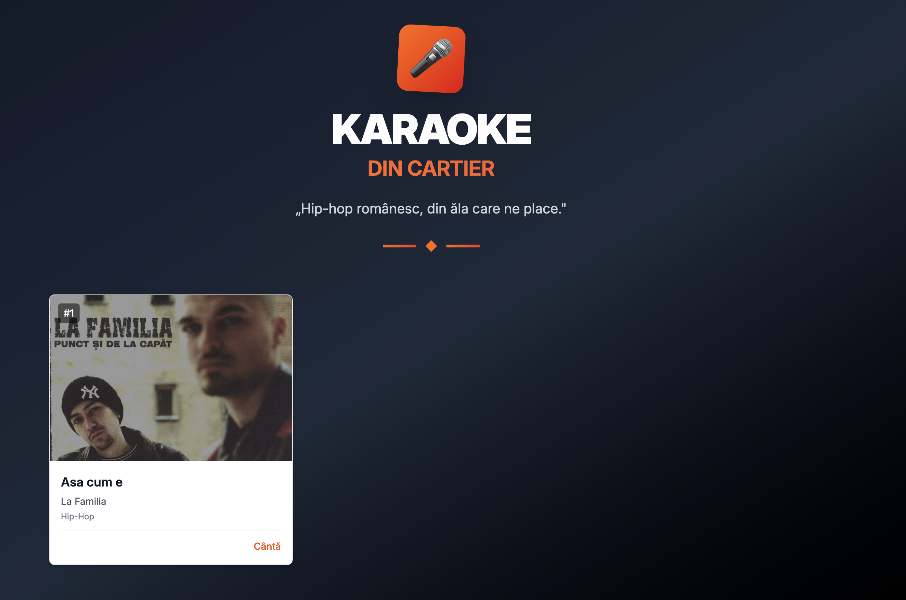
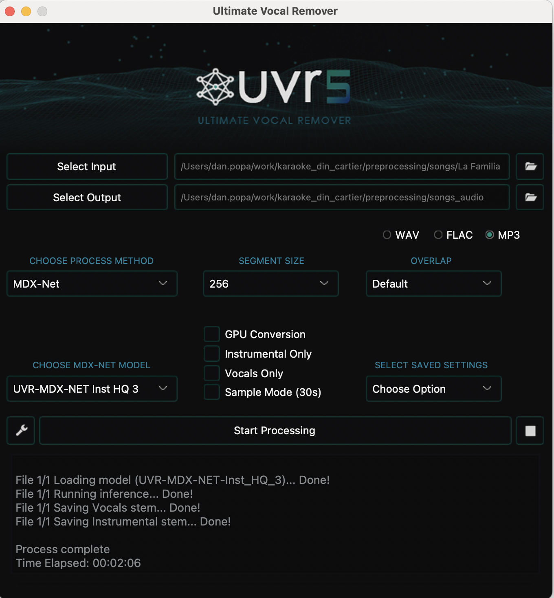

# Karaoke din Cartier

https://karaoke-din-cartier.fly.dev/

## Getting Started

### Client

1. `npm ci`
2. `npm run dev`

Deploy: `npm run deploy` It build a static site and deploys to fly.io

### How to contribute a song

1. Copy paste `output_example` => `output`
2. Install [Ultimate Voice Remover](https://github.com/Anjok07/ultimatevocalremovergui)
3. choose your song and select output to `output/songs_audio` 
4. rename the output into `instrumental.mp3` and `vocal.mp3`
5. fill metadata
6. fill lyrics.txt
   7, replace `screen.png` with your own
7. `uv sync`
8. Run `transcribe.ipynb`
9. Copy paste `.env.example` => `.env`
10. Run `match_transribtion.ipynb`
11. Create a new folder in `client/public/songs`
12. move `output` folder to that one
13. `npm run deploy`(make a pr)
